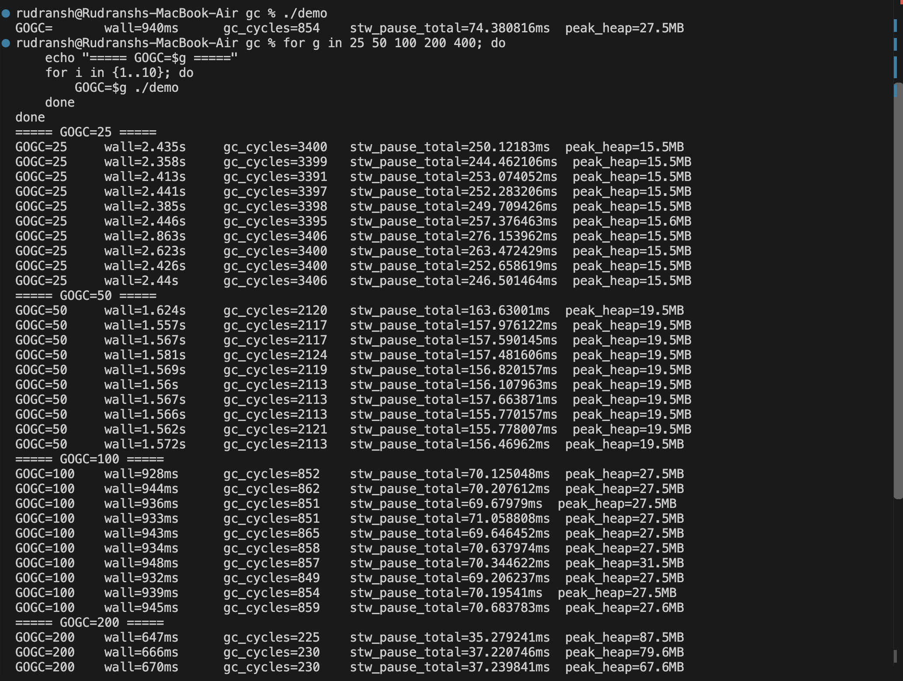
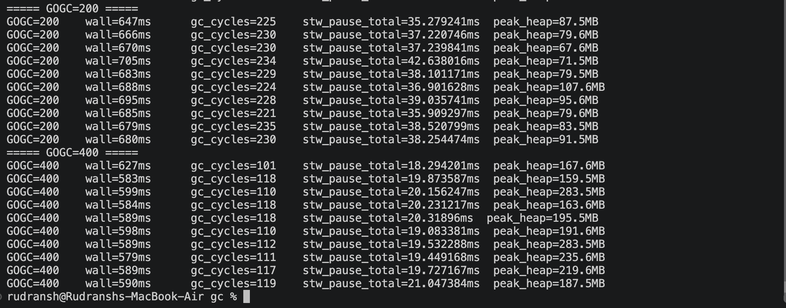

# Go GC Pacing Benchmark --- GOGC, GC Cycles, STW Pauses, Heap Growth & `gctrace`

A small, reproducible Go experiment for understanding how `GOGC` changes
garbage-collector pacing.

The benchmark intentionally creates a large number of short-lived heap
objects and keeps a small fraction reachable. The same workload is then
executed with:

``` text
GOGC=25
GOGC=50
GOGC=100
GOGC=200
GOGC=400
```

The goal is **not** to find a universally "best" `GOGC`. The goal is to
observe the trade-off between:

``` text
GC frequency
     ↕
GC CPU work
     ↕
heap growth / memory
```

> **Important:** The numbers in this README are from one MacBook Air
> run. They are workload- and machine-dependent. Use them to explain the
> shape of the result, not as universal Go GC constants.

------------------------------------------------------------------------

## 1. What this experiment demonstrates

The central observation is:

``` text
GOGC
  ↓
GC pacing
  ↓
heap growth tolerated between GC cycles
  ↓
GC frequency
  ↓
GC CPU overhead + memory footprint
```

Generally:

``` text
Lower GOGC
    ↓
Smaller heap-growth target
    ↓
GC runs more frequently
    ↓
More GC work
    ↓
Lower memory footprint
```

while:

``` text
Higher GOGC
    ↓
Larger heap-growth target
    ↓
GC runs less frequently
    ↓
Less frequent GC work
    ↓
More memory can be retained/obtained
```

This is why `GOGC` should be thought of as a **GC pacing / CPU-vs-memory
trade-off**, not simply a "pause duration" setting.

------------------------------------------------------------------------

# 2. Project structure

A simple project layout can be:

``` text
gc/
├── gc_pacing_demo.go
├── demo
├── README.md
├── gc-25.txt
├── gc-50.txt
├── gc-100.txt
├── gc-200.txt
├── gc-400.txt
└── screenshots/
    ├── benchmark-summary.png
    ├── gc-trace-head.png
    └── gc-trace-tail.png
```

The `gc-*.txt` files contain raw `GODEBUG=gctrace=1` output.

The screenshot paths above are intentionally **dummy
links/placeholders**. Replace them with the actual paths in your GitHub
repository.

------------------------------------------------------------------------


# 4. Understanding the workload

## 4.1 `node`

``` go
type node struct {
    payload [512]byte
    next    *node
}
```

Each allocated object contains:

``` text
512-byte payload
+
pointer to another node
```

The pointer is important because the GC has to understand reachability.

For example:

``` text
live
 ↓
node A
 ↓
node B
 ↓
node C
```

All nodes reachable through this chain are considered live.

------------------------------------------------------------------------

## 4.2 Creating garbage

Inside the loop:

``` go
n := &node{next: live}
```

A new node is allocated every iteration.

Most iterations do not update `live`.

Therefore, many newly allocated objects quickly become unreachable:

``` text
new allocation
     ↓
next iteration
     ↓
old object no longer reachable
     ↓
garbage
```

------------------------------------------------------------------------

## 4.3 Keeping a small fraction alive

Every 500th iteration:

``` go
if i%500 == 0 {
    live = n
}
```

This creates a chain of retained nodes:

``` text
live
 ↓
node
 ↓
node
 ↓
node
 ↓
...
```

So the workload contains both:

``` text
short-lived garbage
+
some reachable objects
```

This gives the GC real work to perform.

------------------------------------------------------------------------

# 5. Why 8 goroutines?

The benchmark uses:

``` go
const workers = 8
const perWorker = 1_000_000
```

Therefore:

``` text
8 goroutines
×
1,000,000 allocations
=
8,000,000 allocations
```

Conceptually:

``` text
Worker 1 → 1M allocations
Worker 2 → 1M allocations
Worker 3 → 1M allocations
...
Worker 8 → 1M allocations
```

The `sync.WaitGroup` makes `main()` wait until all workers finish.

------------------------------------------------------------------------

# 6. What `runtime.KeepAlive` does

At the end:

``` go
runtime.KeepAlive(live)
```

This keeps `live` considered reachable through that point from the
compiler/runtime liveness perspective.

It is useful here because the benchmark intentionally wants the retained
chain to remain live until the function reaches the end.

It does **not** mean the object can never be collected.

------------------------------------------------------------------------

# 7. What `runtime.MemStats` measures

The benchmark takes two snapshots:

``` go
runtime.ReadMemStats(&before)
```

and:

``` go
runtime.ReadMemStats(&after)
```

Then it calculates differences.

### `NumGC`

``` go
after.NumGC - before.NumGC
```

Number of GC cycles that occurred during the measured section.

### `PauseTotalNs`

``` go
after.PauseTotalNs - before.PauseTotalNs
```

Cumulative stop-the-world pause time recorded during the measured
section.

### `HeapSys`

The current program labels this as:

``` text
peak_heap
```

but that label is misleading.

`HeapSys` is the amount of virtual address space obtained from the OS
for the Go heap. It is **not equivalent to peak live heap**.

For a more rigorous version of this benchmark, report `HeapAlloc`,
`HeapSys`, and `HeapObjects` separately.

------------------------------------------------------------------------

# 8. Benchmark commands

## Build

``` bash
go build -o demo gc_pacing_demo.go
```

Quick sanity test:

``` bash
./demo
```

------------------------------------------------------------------------

## Run 10 times for every GOGC

``` bash
for g in 25 50 100 200 400; do
    echo "===== GOGC=$g ====="
    for i in {1..10}; do
        GOGC=$g ./demo
    done
done
```

This produces:

``` text
5 GOGC configurations
×
10 runs
=
50 benchmark runs
```

Multiple runs matter because OS scheduling, CPU frequency, background
activity, runtime scheduling, and memory state can introduce run-to-run
variation.

------------------------------------------------------------------------

# 9. Capture raw GC traces

Run:

``` bash
for g in 25 50 100 200 400; do
    GOGC=$g GODEBUG=gctrace=1 ./demo > "gc-$g.txt" 2>&1
done
```

This creates:

``` text
gc-25.txt
gc-50.txt
gc-100.txt
gc-200.txt
gc-400.txt
```

Inspect the beginning:

``` bash
head -10 gc-100.txt
```

Inspect the end:

``` bash
grep "^gc " gc-100.txt | tail -10
```

------------------------------------------------------------------------

# 10. Raw benchmark results

The following results came from the 10-run benchmark on the MacBook Air.

## GOGC=25

Typical result:

``` text
wall ≈ 2.4s
GC cycles ≈ 3,400
STW pause total ≈ 250ms
HeapSys ≈ 15.5MB
```

Observed GC cycles:

``` text
3400
3399
3391
3397
3398
3395
3406
3400
3400
3406
```

Observed wall times:

``` text
2.435s
2.358s
2.413s
2.441s
2.385s
2.446s
2.863s
2.623s
2.426s
2.440s
```

Observed STW pause totals were approximately:

``` text
244ms – 276ms
```

------------------------------------------------------------------------

## GOGC=50

Typical result:

``` text
wall ≈ 1.57s
GC cycles ≈ 2,117
STW pause total ≈ 157ms
HeapSys ≈ 19.5MB
```

Observed GC cycles:

``` text
2120
2117
2117
2124
2119
2113
2113
2113
2121
2113
```

Observed wall times were approximately:

``` text
1.557s – 1.624s
```

STW pause totals were approximately:

``` text
155ms – 164ms
```

------------------------------------------------------------------------

## GOGC=100

`GOGC=100` is the standard/default setting.

Typical result:

``` text
wall ≈ 0.94s
GC cycles ≈ 850–860
STW pause total ≈ 70ms
HeapSys ≈ 27.5MB
```

Observed GC cycles:

``` text
852
862
851
851
865
858
857
849
854
859
```

Observed wall times:

``` text
928ms
944ms
936ms
933ms
943ms
934ms
948ms
932ms
939ms
945ms
```

STW pause totals were approximately:

``` text
69ms – 71ms
```

------------------------------------------------------------------------

## GOGC=200

Typical result:

``` text
wall ≈ 0.68s
GC cycles ≈ 230
STW pause total ≈ 38ms
HeapSys ≈ 80–90MB
```

Observed GC cycles:

``` text
225
230
230
234
229
224
228
221
235
230
```

Observed wall times:

``` text
647ms
666ms
670ms
705ms
683ms
688ms
695ms
685ms
679ms
680ms
```

HeapSys varied considerably between runs:

``` text
67.6MB
71.5MB
79.5MB
79.6MB
83.5MB
87.5MB
91.5MB
95.6MB
107.6MB
```

This variation is another reason not to present `HeapSys` as a
deterministic "peak heap" number.

------------------------------------------------------------------------

## GOGC=400

Typical result:

``` text
wall ≈ 0.59s
GC cycles ≈ 110–120
STW pause total ≈ 20ms
HeapSys ≈ 160–280MB
```

Observed GC cycles:

``` text
101
118
110
118
118
110
112
111
117
119
```

Observed wall times:

``` text
627ms
583ms
599ms
584ms
589ms
598ms
589ms
579ms
589ms
590ms
```

HeapSys varied substantially:

``` text
159.5MB
163.6MB
167.6MB
187.5MB
191.6MB
195.5MB
219.6MB
235.6MB
283.5MB
283.5MB
```

------------------------------------------------------------------------

# 11. Results summary

  --------------------------------------------------------------------------
            GOGC     Approx. GC   Approx. wall  Approx. total       Observed
                         cycles           time      STW pause        HeapSys
  -------------- -------------- -------------- -------------- --------------
              25        \~3,400         \~2.4s        \~250ms       \~15.5MB

              50        \~2,117        \~1.57s        \~157ms       \~19.5MB

             100          \~855        \~0.94s         \~70ms       \~27.5MB

             200          \~230        \~0.68s         \~38ms    \~68--108MB

             400          \~116        \~0.59s     \~18--21ms   \~160--284MB
  --------------------------------------------------------------------------

The most obvious trend is:

``` text
GOGC ↑
  │
  ├── GC cycles ↓
  ├── total STW pause ↓
  ├── wall time ↓ in this workload
  └── HeapSys generally ↑
```

This is the central experimental result.

------------------------------------------------------------------------

# 12. The most important comparison

Compare the two extremes:

``` text
GOGC=25

~3,400 GC cycles
~2.4s wall time
~15.5MB HeapSys
```

versus:

``` text
GOGC=400

~116 GC cycles
~0.59s wall time
~160–284MB HeapSys
```

The GC cycle count changed by roughly:

``` text
3400 / 116 ≈ 29x
```

So, in this workload:

> GOGC=25 triggered roughly 29× as many GC cycles as GOGC=400.

Do not generalize the exact 29× ratio to other workloads.

------------------------------------------------------------------------

# 13. What the benchmark does NOT prove

This experiment does **not** prove:

``` text
"GOGC=400 is better than GOGC=25"
```

It only shows that this particular workload benefits in wall-clock time
from allowing a larger heap.

A production service may have completely different constraints.

For example:

``` text
High memory availability
+
CPU-sensitive workload
        ↓
Higher GOGC may be attractive
```

But:

``` text
Small container memory limit
+
Memory-sensitive workload
        ↓
Higher GOGC may be dangerous
```

The correct setting depends on workload and resource limits.

------------------------------------------------------------------------

# 14. Reading a `gctrace` line

A typical line from this experiment is:

``` text
gc 100 @0.558s 3%:
0.077+4.8+0.030 ms clock,
0.61+0.092/3.1/0+0.24 ms cpu,
95->134->45 MB,
122 MB goal,
0 MB stacks,
0 MB globals,
8 P
```

The pieces can be viewed as:

``` text
gc 100
│
└── GC cycle number

@0.558s
│
└── approximately 558ms after program start

3%
│
└── GC CPU utilization indicator

0.077+4.8+0.030 ms clock
│
├── first STW phase
├── concurrent GC phase
└── final STW phase

0.61+0.092/3.1/0+0.24 ms cpu
│
├── STW CPU component
├── mark assist
├── background GC work
├── idle GC work
└── final STW CPU component

95->134->45 MB
│
├── heap at beginning of GC
├── heap growth during GC
└── live heap after GC

122 MB goal
│
└── heap goal

8 P
│
└── 8 logical processors available to the runtime
```

------------------------------------------------------------------------

# 15. `clock` vs `cpu`

This distinction is critical.

Consider:

``` text
0.077+4.8+0.030 ms clock
```

The middle:

``` text
4.8ms
```

is concurrent GC activity.

It is **not** a 4.8ms stop-the-world application pause.

The approximate STW portions are:

``` text
0.077ms + 0.030ms
≈ 0.107ms
≈ 107 microseconds
```

Conceptually:

``` text
Application:
████████████████████████████████████

GC:
       │ STW │──── concurrent ────│ STW │
         ↑             ↑             ↑
       .077ms         4.8ms        .030ms
```

The concurrent phase overlaps with application execution.

Therefore:

``` text
GC wall-clock work
        ≠
application pause time
```

------------------------------------------------------------------------

# 16. Mark assist

The CPU section contains a group such as:

``` text
0.092/3.1/0
```

The first value in this assist/background/idle group represents
mark-assist CPU time.

Mark assist happens when an allocating goroutine is required to help the
GC with marking work.

Conceptually:

``` text
Application goroutine
        │
        ▼
     allocate
        │
        ▼
GC needs more marking progress
        │
        ▼
goroutine helps with marking
        │
        ▼
allocation continues
```

This means:

``` text
Low STW pause
```

does not necessarily mean:

``` text
GC has zero CPU impact
```

GC can consume CPU concurrently and allocating goroutines can
participate through assists.

------------------------------------------------------------------------

# 17. What your traces actually show about mark assist

Your traces show mark-assist CPU time, but this benchmark does **not**
justify the stronger claim that:

> mark assist is the dominant source of latency.

For example, this GOGC=400 cycle:

``` text
gc 100 @0.558s 3%:
0.077+4.8+0.030 ms clock,
0.61+0.092/3.1/0+0.24 ms cpu,
95->134->45 MB,
122 MB goal,
...
```

shows approximately:

``` text
mark assist     0.092ms
background GC   3.1ms
```

So the trace demonstrates both assist and background marking, but in
this particular cycle the background component is substantially larger.

A technically safe conclusion is:

> **The workload incurs concurrent GC CPU work and some mark-assist
> work; `gctrace` lets us see those components separately from STW pause
> time.**

------------------------------------------------------------------------

# 18. Why higher GOGC can have larger individual GC work

At GOGC=400, one trace line was:

``` text
gc 100 @0.558s 3%:
0.077+4.8+0.030 ms clock,
...
95->134->45 MB,
122 MB goal
```

Compare the general shape with GOGC=25:

``` text
gc 3400 ...:
0.057+0.49+0.009 ms clock,
...
7->7->4 MB,
7 MB goal
```

The higher-GOGC run allows much more allocation between collections.

Therefore a collection can have:

``` text
larger heap
+
more objects to process
```

even though collections happen much less frequently.

So the correct model is not:

``` text
Higher GOGC
→ smaller GC work per cycle
```

Instead:

``` text
Higher GOGC
→ fewer cycles
→ more allocation between cycles
→ potentially larger individual GC work
→ much less frequent collection overall
```

------------------------------------------------------------------------

# 19. Heap goal examples

Your traces show the effect of GOGC very clearly.

Early cycles included approximately:

``` text
GOGC=25   → 1MB goal
GOGC=50   → 2MB goal
GOGC=100  → 4MB goal
GOGC=200  → 8MB goal
GOGC=400  → 16MB goal
```

This is an intuitive way to visualize the pacing difference:

``` text
GOGC=25

heap ────────┐
             │
          GC │
             │
             ▼


GOGC=400

heap ─────────────────────────────┐
                                  │
                               GC │
                                  │
                                  ▼
```

Higher GOGC gives the heap more room to grow before another GC cycle is
required.

------------------------------------------------------------------------

# 20. The `X -> Y -> Z` values

Example:

``` text
95->134->45 MB
```

Conceptually:

``` text
95 MB
│
└── heap at start of GC

134 MB
│
└── heap grew while GC was running

45 MB
│
└── live heap remaining after collection
```

So:

``` text
95 MB allocated at start
        ↓
allocation continues
        ↓
134 MB
        ↓
GC completes
        ↓
45 MB remains live
```

The difference represents a large amount of temporary garbage that
became reclaimable.

------------------------------------------------------------------------

# 21. Why the workload creates so much garbage

The benchmark creates:

``` text
8,000,000 allocations
```

but only keeps a small fraction reachable through:

``` go
if i%500 == 0 {
    live = n
}
```

Therefore most objects eventually look like:

``` text
node
 ↓
unreachable
```

while a smaller chain looks like:

``` text
live
 ↓
node
 ↓
node
 ↓
node
```

The GC must identify the second group as live and can reclaim the first
group.

------------------------------------------------------------------------

# 22. A better version of the output

The current program prints:

``` text
peak_heap
```

but that is based on:

``` go
after.HeapSys
```

A more accurate benchmark should report:

``` text
HeapAlloc
HeapSys
HeapObjects
NumGC
PauseTotalNs
wall time
```

For example:

``` text
GOGC=100
wall=...
gc_cycles=...
stw_pause_total=...
heap_alloc=...
heap_sys=...
heap_objects=...
```

This avoids calling `HeapSys` "peak heap".

------------------------------------------------------------------------

# 23. Recommended benchmark methodology

For repeatable measurements:

1.  Use the same machine.
2.  Use the same Go version.
3.  Use the same source code.
4.  Use the same `GOMAXPROCS`.
5.  Run each configuration multiple times.
6.  Record raw output.
7.  Compare median/typical values rather than one lucky run.
8.  Keep `gctrace` runs separate from timing runs when you care about
    precise wall-time measurements.
9.  Don't generalize synthetic benchmark numbers to production without
    validating with production-like workloads.

A useful experimental structure is:

``` text
                 Same workload
                       │
       ┌───────────────┼────────────────┐
       ▼               ▼                ▼
    GOGC=25         GOGC=100         GOGC=400
       │               │                │
       ▼               ▼                ▼
    metrics         metrics          metrics
       │               │                │
       └───────────────┼────────────────┘
                       ▼
                  comparison
```

------------------------------------------------------------------------

# 24. GOGC=off

You can separately test:

``` bash
GOGC=off ./demo
```

With automatic GC disabled:

``` text
allocation
    ↓
heap grows
    ↓
objects are not automatically reclaimed
    ↓
memory pressure increases
    ↓
possible OOM
```

This is not a free performance optimization.

It exchanges GC work for memory consumption.

If you use:

``` bash
timeout 30 env GOGC=off ./demo
echo $?
```

remember that `timeout` is commonly available on Linux but is not
normally installed by default on macOS.

Also, exit code `137` means the process received `SIGKILL`; it is
commonly associated with an OOM kill in containers/Linux, but the exit
code by itself does not prove that the Linux OOM killer was responsible.

------------------------------------------------------------------------

# 25. GOMEMLIMIT

`GOGC` and `GOMEMLIMIT` address different aspects of GC pacing.

Conceptually:

``` text
GOGC
  ↓
heap-growth-based pacing
```

while:

``` text
GOMEMLIMIT
  ↓
memory-budget constraint
```

This becomes especially important in containers.

For example:

``` text
Container memory limit
        │
        ▼
       2GB
        │
        ▼
GOMEMLIMIT
        │
        ▼
   runtime tries to
   stay within budget
```

Under memory pressure, the runtime can perform more GC work rather than
allowing memory usage to continue growing unchecked.

Again, there is no magic elimination of cost:

``` text
less memory pressure
       ↕
more GC CPU work
```

------------------------------------------------------------------------

# 26. Main conclusions from this experiment

### Conclusion 1 --- GOGC primarily changes GC pacing

``` text
GOGC ↑
  ↓
larger heap-growth target
  ↓
fewer GC cycles
```

### Conclusion 2 --- Lower GOGC costs more GC work

Your workload showed:

``` text
~3,400 cycles at GOGC=25
```

versus:

``` text
~116 cycles at GOGC=400
```

### Conclusion 3 --- Higher GOGC used more heap space

Your measured `HeapSys` was roughly:

``` text
15.5MB at GOGC=25
```

versus values reaching:

``` text
160–284MB at GOGC=400
```

### Conclusion 4 --- STW pause is only part of GC cost

A line such as:

``` text
0.077+4.8+0.030 ms clock
```

does not represent a 4.877ms application pause.

Most of that example is concurrent GC work.

### Conclusion 5 --- GC can consume CPU without long STW pauses

The CPU section shows concurrent/background GC work and mark-assist
work.

Therefore:

``` text
low STW pause
≠
zero GC overhead
```

### Conclusion 6 --- There is no universally best GOGC

The right value depends on:

``` text
CPU budget
+
memory budget
+
allocation rate
+
latency requirements
+
workload shape
+
container limits
```

------------------------------------------------------------------------

# 27. The key mental model

Keep this diagram:

``` text
                         GOGC
                          │
                          ▼
                  GC pacing decision
                          │
              ┌───────────┴───────────┐
              ▼                       ▼
         lower GOGC               higher GOGC
              │                       │
              ▼                       ▼
       smaller heap goal        larger heap goal
              │                       │
              ▼                       ▼
       more GC cycles            fewer GC cycles
              │                       │
              ▼                       ▼
       more GC CPU work          less frequent work
              │                       │
              ▼                       ▼
      lower memory footprint     larger memory footprint
```

Inside each cycle:

``` text
                    GC cycle
                       │
        ┌──────────────┼──────────────┐
        ▼              ▼              ▼
      STW          Concurrent        STW
      phase          marking         phase
        │              │              │
        │              ├── background │
        │              │    workers   │
        │              │              │
        │              └── mark       │
        │                  assists    │
        ▼                             ▼
   short pause                    short pause
```

------------------------------------------------------------------------

# 28. Reproduction

### Build

``` bash
go build -o demo gc_pacing_demo.go
```

### Quick run

``` bash
./demo
```

### Benchmark

``` bash
for g in 25 50 100 200 400; do
    echo "===== GOGC=$g ====="
    for i in {1..10}; do
        GOGC=$g ./demo
    done
done
```

### GC traces

``` bash
for g in 25 50 100 200 400; do
    GOGC=$g GODEBUG=gctrace=1 ./demo > "gc-$g.txt" 2>&1
done
```

### Inspect traces

``` bash
head -10 gc-100.txt
```

``` bash
grep "^gc " gc-100.txt | tail -10
```

------------------------------------------------------------------------


# 29. Screenshot placeholders

The screenshots shown during the experiment can be stored in your
repository and linked here.

### Benchmark summary

<p align="center">
  
</p>

<p align="center">
  
</p>


### `gctrace` early cycles

<p align="center">
  
</p>

<p align="center">
  
</p>

### `gctrace` late cycles

<p align="center">
  
</p>
<p align="center">
  
</p>


------------------------------------------------------------------------


# 30. What this experiment teaches

The final mental model is:

``` text
More allocations
       ↓
More GC work required
       ↓
GC pacer decides when to run
       ↑
     GOGC
       │
       ├───────────────┐
       │               │
       ▼               ▼
 lower GOGC        higher GOGC
       │               │
       ▼               ▼
 more frequent      less frequent
 GC                 GC
       │               │
       ▼               ▼
 more CPU           more memory
       │               │
       └───────┬───────┘
               ▼
          resource trade-off
```

This is the foundation for the next GC topics:

``` text
GC pacing
   ↓
Heap goal
   ↓
Allocation rate
   ↓
Mark assist
   ↓
GC CPU overhead
   ↓
GOMEMLIMIT
   ↓
Production GC tuning
```
